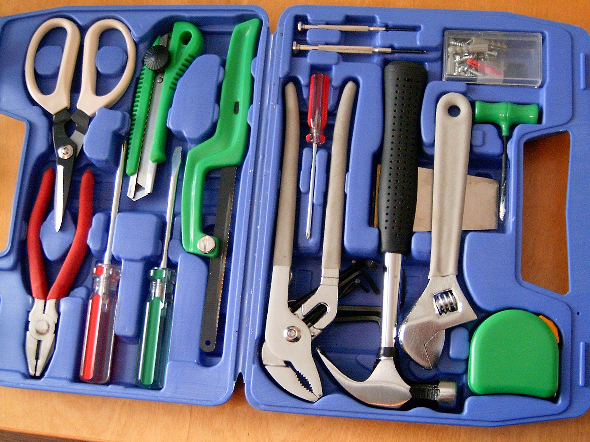

build-lists: true
footer: Fagkveld Webstep Fokus 24. november 2016

# [fit] Deployment i
# [fit] _Origo-prosjektet_

---

# Hvordan hostes ofte apps?

- Applikasjon inni IIS
- Applikasjonspakke på PaaS
- Docker
- Virtuell maskin

^
IIS: minimal isolasjon
PaaS (Heroku, Appharbor, Azure PaaS): litt mer isolasjon, dårlig kompatibilitet
Docker: Full isolasjon, bra kompatibiltet
Virtuell maskin: Full isolasjon, men tungt

---

# [fit] Docker

---

## Docker
- Isolert fra omgivelsene
- Plattformuavhengig*
- Lettvekts containere


^ Windows-issues, men de kan man leve med

---

# Kjøring av Dockercontainere
- `docker run ...`
- Hva med skalering?
- Og overvåkning/logger?
- AWS, Azure, Digital Ocean++
- Men internt..?

^
Lett å kjøre på egen maskin.. Men hvordan overvåke og skalere?
Mange fine skytjenester med ferdig opplegg for det.
Men hva med internt?

---

# [fit] Apache Mesos
### _(en innendørs sky)_

---

# Mesos
- En distribuert kernel
- Kjører på et sett med maskiner
- Tilbyr en pool med ressurser
- Native støtte for Docker

---

# Konsepter i Mesos
- _Agenter_ rapporterer ressurser til en _master_
- Masteren tilbyr ressurser til et _framework_
- Frameworkets _scheduler_ gir _tasks_ til masteren
- Masteren allokerer tasks til en ledig agent

---


Ressursallokering i Mesos

---

# [fit] Mesosphere Marathon
### _(et mesosrammeverk)_

---

## Marathon
- Start/Stopp/Skalering
- Persistens
- Administrasjons-UI

---


---

# [fit] Deployment i
# [fit] _Origo-prosjektet_

---

## Litt om oss

- Søk i videoer (og lyd) i NRK
- Import/Eksport til og fra redigeringsverktøy
- Workflows
- Behov for rask tilgang til PB med data

---

# Verktøy vi bruker

- NPM-script
- TeamCity
- Octopus Deploy
- Marathon
- Mesos



---

## NPM Script
```JavaScript
{
  "start": "...",
  "test": "..",
  "build-docker": ".."
}
```

- Alt trigges via NPM
- Kan bygge alt lokalt

^ Ikke optimal windows-opplevelse..

---

## TeamCity


---

## TeamCity

- Kjører CI-bygg
- Bygger og pusher docker-image
- Lager release i Octopus

---

## Octopus Deploy


---

## Octopus Deploy

- Oversikt over miljø/versjon
- Auto-deploy til dev/stage
- Promotering til Prod
- Konfigurasjon
- Deployer vha POST til Marathon

---

## Marathon

- Eies av drift
- Loadbalancing/DNS
- Pusher til Mesos


---

## Mesos

- Hosting av applikasjoner
- Logging (stdout til ES/Kibana)

---


---

# [fit] Spørsmål?
